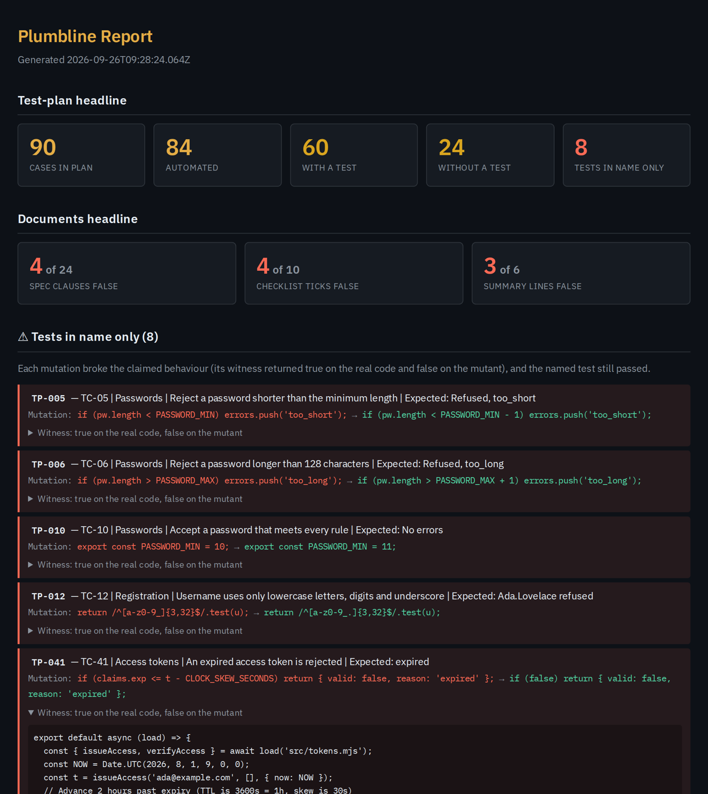

<div align="center">


**Is your test plan still true? Plumbline gets IBM Bob to read your test plan, spec and release
checklist, find the test behind each claim, and then break the code to see if the test notices.**

[Hosted checker](https://plumbline-smoky.vercel.app/check/) ·
[A real Plumbline report](https://plumbline-smoky.vercel.app/report/turnstile.html) ·
[The worked example, scored](examples/README.md) ·
[How I used Bob](docs/bob/SESSIONS.md) ·
[Slides](deck/plumbline-deck.pdf) ·
[How the number was measured](docs/MEASUREMENT.md)

</div>

---

## Don't take my word for it

Every claim in this README, and where to check it.

| Claim | Where to check |
|---|---|
| The sample's test plan says all 84 automated cases pass. Bob found a test for 60 of them. | [`examples/turnstile/.plumbline/claims.json`](examples/turnstile/.plumbline/claims.json), or the [report](https://plumbline-smoky.vercel.app/report/turnstile.html) |
| 8 of those tests stay green when Bob breaks the thing they're named after, and each one comes with a witness showing the break is real | the first list in the report; the witnesses are in `claims.json` |
| 4 of the 24 spec clauses and 4 of the 10 ticked checklist items are false | the report's second row, with one line of evidence each |
| Bob's audit matches an answer key I wrote before Bob ran: 83 of 84 mappings, 24 of 24 spec clauses, 10 of 10 checklist items | `node examples/score.mjs` |
| The answer key itself holds up | `node examples/answer-key/verify-ground-truth.mjs <clone> --self-test` flips every expectation and catches all 83 |
| Bob built everything Bob does here during the event: 8 tasks, 29.86 of the 40 Bobcoins | [`docs/bob/SESSIONS.md`](docs/bob/SESSIONS.md), the exports in [`docs/bob/tasks/`](docs/bob/tasks/), the screenshots in [`bob_sessions/`](bob_sessions/) |
| 23 of the 100 most-starred installable repositories on GitHub owned by organisations fail a check against their own README | [`docs/MEASUREMENT.md`](docs/MEASUREMENT.md); two final runs, 23 and 22 |
| You can paste any public repository and get a result | the [hosted checker](https://plumbline-smoky.vercel.app/check/) |
| Every number on every page here agrees with every other | `node facts/render.mjs --check` (and `--self-test`, which proves it can fail) |
| Plumbline passes its own audit | `npx github:iamrobertmoore/plumbline --repo .` in a clone of this repository |

## Why I built this

A while back I shipped a project whose CI badge was green for days while it ran no tests at all. The
job was skipping every test because it was waiting on a credential that didn't exist. It was green,
so nobody looked.

Test plans have the same problem, just in a spreadsheet. Before a release someone signs a checklist
saying every case in the plan has a passing test and the spec matches the code, and in my experience
nobody really checks. Coverage tells you a line ran, which isn't the same as something being
asserted. Mutation testing breaks code at random and scores the whole suite, but it never looks at
the plan. Doc drift tools compare a commit with the docs it touched, so they can't see a claim that
was wrong from day one.

## What it does

Plumbline is a **custom mode and a skill for IBM Bob**. Copy [`.bob/`](.bob/) into your repository,
open it in Bob, switch to the **Plumbline** mode and ask it to audit. It works in five stages:

1. **Read.** Bob reads the test plan (`.xlsx`), the spec (`.docx`) and the release checklist (`.pdf`),
   and turns each row, clause and ticked item into a claim, noting the cell or clause it came from.
2. **Map.** A subagent per test file works out which test proves each automated case, including tests
   whose names don't mention the case id. If there's no test, that's recorded as a finding rather than
   a guess.
3. **Break.** For every case with a test, a subagent per test file writes a change to the code that
   should make the case fail. **It never sees the test.** It also writes a **witness**, a few lines
   that pass on the real code and fail on the broken code. `plumbline-run.mjs` applies each change in
   a throwaway git worktree, runs the witness both ways, then runs the test. If the test stays green
   while the witness shows the behaviour is broken, it's a **test in name only**.
4. **Judge.** Bob checks each spec clause, checklist item and summary line against the code, the
   changelog and the git history, with a line of evidence for each.
5. **Report.** A single self-contained HTML page.

### What it found on Turnstile

Turnstile is a small auth service I wrote for this. Before Bob saw it, I wrote down every defect in it
in an [answer key](examples/answer-key/GROUND-TRUTH.md). Its test plan says all 84 automated cases
pass, and all 10 items on its release checklist are ticked.

- **24 of the 84 cases have no test at all.** Bob found a test for 60.
- **8 tests pass on broken code.** My favourite is TC-41, "rejects an expired access token". The test
  only checks that a result came back, so you can delete the expiry check entirely and it stays green.
  Two of the eight were real problems I'd missed in my own answer key: TC-12's bad example fails on
  its capital letters, so the rule it's named after never gets tested, and TC-42 passes even when the
  refresh token is `undefined`.
- **The spec is wrong in 4 places.** It says bcrypt (the code uses scrypt) and 15-minute access tokens
  (they've been 60 minutes since commit `1838534`, which the changelog never mentions).
- **4 of the 10 ticks are false**, including "the spec has been reviewed against the implementation".

The full comparison with the answer key is in [`examples/README.md`](examples/README.md).



### Why it shouldn't blame a good test

Mutation testing has a well-known weak spot: sometimes the change looks like a break but doesn't
actually change the behaviour, and you end up blaming a test that was fine. My first run did exactly
that, 4 times out of 12. So now nothing gets called a test in name only without proof:

- no witness: `UNPROVEN`
- a witness that fails on the real code: `WITNESS_INVALID`
- a witness that shows the change broke nothing: `WEAK_MUTATION`

If you strip every witness out of the same run, it accuses **nobody**.

The free checks work the same way. Each one ships with a negative control, and a check that can't be
shown to fail gets reported as unproven rather than passed.

```
$ npx github:iamrobertmoore/plumbline --selfcheck
6/6 checks proved able to fail. Result: PROVEN.
```

## How I used IBM Bob

Bob isn't just what I built this with. Plumbline runs inside Bob, and pulling out any one of these
stops the document side working:

| # | Bob feature | What it does in Plumbline | Where |
|---|---|---|---|
| 1 | **Custom mode** | the Plumbline mode: what it's for, and which tools it's allowed (read, edit, execute, skills, subagents, todo) | [`.bob/custom_modes.yaml`](.bob/custom_modes.yaml) |
| 2 | **Skills** | the five stages, the claim format and the rules for keeping Bobcoin use down | [`.bob/skills/plumbline/SKILL.md`](.bob/skills/plumbline/SKILL.md) |
| 3 | **Document understanding** | reads the `.xlsx` plan and the `.docx` spec with `office_read`. Bob's file tools couldn't read the `.pdf` checklist, so Bob wrote a small reader for it | `SKILL.md` §1.2 to §1.4, [`pdf-text.mjs`](.bob/skills/plumbline/pdf-text.mjs) |
| 4 | **Subagents** | one per test file to map cases to tests, and one per test file to write the mutations and witnesses without seeing the test | `SKILL.md` §2.2 and §3.2 |
| 5 | **Agent mode with commands** | runs the mutation runner, plus read-only git (`git log`, `git diff v2.2.0 v2.3.0`) for checking the spec and checklist | `SKILL.md` §3.4 and §4 |
| 6 | **Bob as the builder** | Bob planned and wrote the mode, the skill, the runner, the report, the PDF reader and their tests, and ran every audit | [`docs/bob/SESSIONS.md`](docs/bob/SESSIONS.md) |

Without Bob, nobody reads the plan, the spec or the checklist, nothing links a claim to a test, and
nothing writes the change that tries to break it. You'd be left with the free link checker.

I reviewed every task, and a fair bit needed correcting. Bob's first plan aimed each mutation at "the
smallest change that makes the named test fail", which would only ever confirm what a test already
checks. Its first runner couldn't tell a mistyped test name from a passing test. Its first go at
judging called a false checklist tick "partial". Every correction is in
[`docs/bob/SESSIONS.md`](docs/bob/SESSIONS.md) along with who fixed it. I did the small ones myself;
the bigger ones Bob fixed in a later task, from a brief I wrote.

## The free side: any repository, no AI

The checks that don't need judgement run without Bob: README links, files the README points at,
install commands, published versions, licences, and CI that can't actually fail. They run in the
hosted checker and on the command line.

**23 of the 100 most-starred installable repositories on GitHub owned by organisations fail at least one
of them.** Create React App's README, for example, still sends people to documentation at an address
that stopped working when the site moved. That's 12,269,541 stars between them, measured on
25 September 2026. The method, the rule for picking the repositories, and all eighteen corrections I
made to the checks along the way are in [`docs/MEASUREMENT.md`](docs/MEASUREMENT.md). My first pass
said 89 of 100, which was wrong, and wrong in a way that made the tool look good, so I went through
every finding by hand until the number held up.

```bash
npx github:iamrobertmoore/plumbline --repo .   # audit the current repository
npx github:iamrobertmoore/plumbline --selfcheck # prove every check can fail
```

It exits `0` on a pass or a warning, `1` on a blocker, and `2` if a check can't be shown to fail. No
runtime dependencies, Node 20 or later. Run the suite with `npm test` (86 tests); eleven of them hit
the npm registry and skip rather than fail when you're offline.

## Business

| | |
|---|---|
| **Free** | The deterministic checks, hosted and in CI, for any repository. No Bob and no running cost. |
| **Paid** | **$20 per repository per month** for the document side: the test plan, the spec and the checklist, every claim mapped to a test and every test checked by breaking the code behind it. |
| **Who pays** | The release owner, whoever signs the checklist. They're the one on the hook when it's wrong, and in regulated teams they're the one who has to show an auditor the plan was actually tested. |
| **Whose Bob** | The team's own Bob seat. Plumbline installs as a mode and a skill; the Bobcoins are the team's, and the $20 is for Plumbline. For scale: auditing Turnstile (90 cases, 24 clauses, 10 items) took tasks 04 to 08 and 18.2 Bobcoins, including every rerun and the improvements I made to the skill along the way. |
| **How it grows** | One repository, then the rest. It sits in the release process, and nobody wants one repo checked and the others not. |

## What was built when

- **Before the event:** the free side (`src/`, the CLI, the negative controls), the measurement
  (`measure/`), the hosted checker, and the Turnstile sample with its answer key. None of that uses AI.
- **During the event, with Bob:** everything in [`.bob/`](.bob/), `test/plumbline-run.test.mjs`, and
  every audit of Turnstile. Eight Bob tasks, each exported to [`docs/bob/tasks/`](docs/bob/tasks/),
  with a screenshot of what it cost in [`bob_sessions/`](bob_sessions/).

## Limitations

- **I wrote the sample.** That's what let me write the answer key before Bob ran, so Bob's result can
  be checked. It also means it's one repository. Bob did find two defects my key had missed, which at
  least suggests the key wasn't rigged in its favour.
- **Bob sometimes miscounts in prose.** Twice it wrote a number its own file contradicted. The report
  now takes its counts from a script, and the skill tells Bob to do the same.
- **One mapping differs from the key.** Bob refused to map TC-43 to a test that doesn't test it; the
  key maps it and marks it a test in name only. Both flag it, just differently.
- **The free-side number is a snapshot.** Links rot and servers time out, so it comes with its date
  and the range across runs.

## Data used

No personal information, client data or social media. Turnstile and every name in it are made up
(email addresses use the reserved `example` domain). The free side and its measurement only read
public data: GitHub's REST API and raw file host (metadata, READMEs and file trees of
organisation-owned repositories), the npm registry, and the URLs those READMEs link to.

## Licence

MIT. See [LICENSE](LICENSE).
