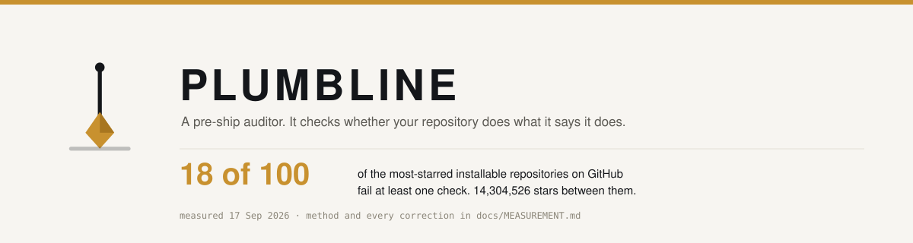
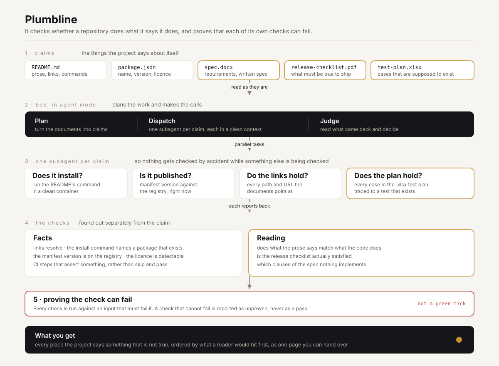

<div align="center">



**A pre-ship auditor. It checks whether your repository does what it says it does, and it proves
that each of its own checks can fail.**

[Live report](https://iamrobertmoore.github.io/plumbline/) ·
[Slide deck](deck/plumbline-deck.pdf) ·
[Architecture](docs/architecture.svg) ·
[How the number was measured](docs/MEASUREMENT.md) ·
[Who wrote the code](docs/AUTHORSHIP.md) ·
[Run it in CI](.github/workflows/plumbline.yml)

</div>

---

## The problem, measured

**I checked the 100 most-starred installable repositories on GitHub against their own claims.
23 of them fail at least one check.**

The clearest one is `ruvnet/RuView`, rank 90 of the 100. Its README links the same architecture
decision record twice, under two different filenames. One exists. The other has never existed in the
repository.

That is 14,304,526 stars of software. These are the best-maintained, most-read READMEs in public
existence, and 23 in every 100 still describe themselves inaccurately right now.

**And more of it is machine-written every month.** In the same 100 repositories, **61 carry commits
that name an AI agent as a co-author**, and **11% of their 9,936 most recent commits declare one**. I
measured that too, because every published figure for it turns out to be a marketing number that
cannot be checked. The method is in [`docs/AUTHORSHIP.md`](docs/AUTHORSHIP.md), and it is deliberately
a lower bound: a commit that was agent-assisted without saying so is counted as human.

Measured 23 Sep 2026. Method, corpus, and every correction I made to the checks are in
[`docs/MEASUREMENT.md`](docs/MEASUREMENT.md). The first pass said 89 of 100. That was wrong, and it
was wrong in the direction that flattered the product, so I went back through the findings by hand
until the number survived scrutiny.

| What the repository claims | What is actually true | How many, of 100 |
|---|---|---|
| the links in the README work | 17 have links that return 404 or 410 | **17** |
| the version in the manifest is published | 4 disagree with the registry | **4** |
| the README points at files that exist | 2 link to files that are not in the repository | **2** |
| a version named in the README is published | 1 names a version that is not | **1** |
| the licence shows in the About panel | 1 has a licence file GitHub cannot detect | **1** |
| it has a README | 1 has no README at all | **1** |

That is **26 findings across 23 repositories**, because three repositories fail more than one check.
The column counts repositories, not findings.

## The person this is for

It is the hour before you ship. You think you are finished. Nobody has read your README since you
wrote it, your CI has been green for a month, and the demo link in it was renamed in March.

Green is not the same as true. Nothing in a normal pipeline reads what the documentation claims and
goes and checks. So the claims rot quietly, and the first person to find out is a user.

## What it does

Plumbline reads everything a project says about itself. The README, the manifest, and the documents
a real team keeps: the specification, the release checklist, the test plan. It treats all of that as
a set of **claims**, then tests each one against reality, in parallel, with one subagent per claim.

It does not tell you whether your code works. It tells you every place your project says something
that is not true, ordered by what a reader would hit first.

### Try this, watch what happens

| | |
|---|---|
| **See a real finding** | [The report on ruvnet/RuView](https://iamrobertmoore.github.io/plumbline/#finding). Its README links the same architecture decision record twice, to two different filenames. One exists. One never has. |
| **Check the tool, not the claim** | [The negative controls](https://iamrobertmoore.github.io/plumbline/#controls). Every check is run against an input designed to fail it. A check that cannot fail is reported as unproven, never as a pass. |
| **Run it on your own repo** | `npx github:iamrobertmoore/plumbline --repo .` |

## Why it is not a bundle of linters

Every check here has a tool that does something similar. None of them does this.

| What you already use | What it does | What it does not do |
|---|---|---|
| **SonarQube**, **Snyk** | read your code | read what your project claims about itself. Neither has an opinion on whether the README is true. |
| **Dependabot**, **Renovate** | keep your dependencies current | check that your own published version exists. |
| **lychee**, **markdown-link-check** | check that links resolve | anything else. That is one of the six checks here, and it is not the interesting one. |
| **documentation drift tools** | compare a commit against the docs it should have touched | see anything the commit did not touch, so a README that was wrong when it was written stays invisible. |
| **all of them** | report a result | show that the result means anything. |

**This is not a documentation drift detector**, and it is worth saying so plainly, because that is
the category it gets filed under. A drift detector compares what a commit changed against the
documentation it should have updated. That question cannot see a README that was wrong the day it
was written, and that is most of what I found: the RuView link above was never correct, so there is
no commit to diff against. Two teams independently shipped a project called DriftGuard in the last
IBM Bob hackathon. I am not the third. Drift is the first thing this model gets pointed at, not the
model.

That last row is the point, and it is the one thing all four of the tools above have in common. What
none of them do is **prove their own checks can fail**.

A check that has never been observed to fail is not evidence. I have shipped a green CI badge that
was doing nothing at all: a conformance job that ran nightly for days and skipped every test, because
it gated on a credential that did not exist. It passed, so nothing drew attention to it. I found it
on submission day.

So every check in Plumbline ships with a **negative control**. Before it is allowed to report a pass,
it is run against an input built to fail it. If the check does not fail, the result is `UNPROVEN` and
the run exits non-zero.

```
$ npx github:iamrobertmoore/plumbline --selfcheck
6/6 checks proved able to fail. Result: PROVEN.
```

## How IBM Bob is used

**Bob access starts on 25 September, so this section is a design, not a description of code that runs
today.** The half of the tool that needs no judgement is built, runs in CI on every push, and is what
produced the number above. The half below is what gets wired in on the 25th.

Four of Bob's capabilities do real work in that design, and none of them is decoration.

- **Document understanding.** The claims come out of real documents, not just markdown. Bob reads
  `.docx`, `.pdf` and `.xlsx` as they are, so a specification, a release checklist or a test plan can
  be the source of a claim. The flagship check is test-plan coverage: every case in the `.xlsx` plan
  traced to a test that exists, and a list of the ones nobody wrote. No existing tool can do that,
  because no existing tool reads the plan.
- **Subagents.** One subagent per claim, each with its own clean context, so nothing gets checked by
  accident while something else is being checked.
- **Parallel tasks.** Claims that do not depend on each other are checked at the same time, so a
  hundred-repository corpus does not have to queue up.
- **Agent mode.** Runs the whole thing, decides what is left to check, and writes the result.

A claim the tool cannot observe is reported as **not observable**, never as a pass. That holds for the
half that runs today, and it will hold for the half Bob handles.

## Architecture



## Run it

```bash
npx github:iamrobertmoore/plumbline --repo .   # audit the current repository
npx github:iamrobertmoore/plumbline --selfcheck # prove every check can fail
npx github:iamrobertmoore/plumbline --repo . --format json --out r.json
```

Exits `0` on a pass or a warning, `1` on a blocker, `2` when a check cannot be shown to fail. A
warning is a note about the repository, not a reason to hold a release, so it does not break the build.

Zero runtime dependencies. Node 20 or later. Reads the repository, writes nothing.

The suite is `node --test test/*.test.mjs` (78 tests). Eleven of them reach the npm registry and skip
rather than fail when the network is down. The rest run offline, including six that run against a
**local HTTP server**, so the redirect, the request method and the request headers are all tested
without depending on a real host happening to misbehave on the day.

A claim the tool cannot observe is reported as **not observable**, never as a pass and never as a
failure. If the About panel cannot be seen, or a package name on the registry turns out to belong to
a different project, Plumbline says so and moves on. It does not guess, and it does not accuse.

> **On the package name.** `plumbline` on npm is an unrelated Angular component-testing utility
> (v10.0.9, last published 2022), so `npx plumbline` installs the wrong tool. Until this is published
> under a name that is free, the `github:` form above is the correct way to run it.

## Honest limitations

- **A failing check is not broken software.** A dead link in a README does not stop anyone installing
  the package. That is precisely why these defects survive: no test looks at what the docs claim.
- **The number is a snapshot.** Links rot and versions move. It carries its date for that reason.
- **The corpus is not a random sample of GitHub.** It is deliberately the strongest end, so 23% is a
  floor rather than an average.
- **The number has moved in both directions, and which direction is the point.** The first pass said
  89 of 100. Corrections 1 to 6 took it down to 18, each removing an accusation the evidence did not
  support. Correction 10 took it back up to 30, because the harness was testing only the first 25 links
  in each README and that bound was hiding failures. Correction 11 took it to 22, because the request
  did not look like a browser and one server answered it accordingly. A tool that finds more problems
  when you fix it is finding problems that were not there, and a tool that finds fewer when you fix it
  is admitting it was wrong. All thirteen corrections are in
  [`docs/MEASUREMENT.md`](docs/MEASUREMENT.md).
- **The number is what a run reports plus what a hand check adds, and the two are not the same.** Four
  full runs on 23 September returned 22, 26, 23 and 22. The quantities that come from the corpus are
  identical to the digit in every one of them: 9,715 links found, 9,351 checked, 364 badges, 1,650
  relative links. The outcome of each individual link is not, because a server that times out in one run
  can answer 404 in the next, and only the 404 is a finding. **41 of the 100 had at least one link that
  could not be reached**, so a run reports a candidate set and not a census. The count here is 23: the
  22 that fail in every run, plus one repository a run clears only because it cannot reach 32 of its
  links. Both of those links were re-checked by hand and both are 404. A re-run will land between 22
  and 26.
- **CI that cannot fail is reported as a warning, not a failure.** Across 1,768 workflow files in the
  same 100 repositories, **6 have a step or job marked `if: false`**, which can never run, and **55
  have a step marked `continue-on-error`**, whose failure does not fail the job. Neither counts toward
  the headline, because `continue-on-error` on a docs job is a deliberate choice rather than a lie.
  Reproduce it with [`measure/ci-warnings.mjs`](measure/ci-warnings.mjs).
  An earlier pass put this figure at 47 by counting any `|| true`. That was wrong. `|| true` is used
  legitimately inside command substitution and at the end of best-effort cleanup, and the pattern even
  matched a comment explaining why a workflow does **not** use it.

## Licence

MIT. See [LICENSE](LICENSE).
