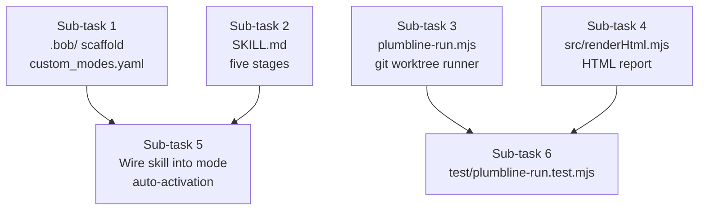

# Plan a Bob skill and custom mode called Plumbline. Given a repository, it must: (1) read the test plan (.xlsx), spec (.docx) and release checklist (.pdf) under docs/ into a claims.json, one entry per plan row, spec clause and checklist item, with its source cell or clause; (2) map every automated test-plan case to the test that proves it, or none, using one subagent per test file; (3) for every mapped case, write the smallest code change that makes the case false, as JSON edits, again one subagent per test file; (4) judge each spec clause and checklist item against the code and git history; (5) produce an HTML report. A script, plumbline-run.mjs, applies each edit in a throwaway git worktree, runs the mapped test, and records whether it failed. A test that still passes is "a test in name only". Keep Bobcoin use low: batch by file, never per case. Output the plan only.

---

**Status:** active  **Date:** 2026-09-25

---

### 👤 User

Plan a Bob skill and custom mode called Plumbline. Given a repository, it must: (1) read the test plan (.xlsx), spec (.docx) and release checklist (.pdf) under docs/ into a claims.json, one entry per plan row, spec clause and checklist item, with its source cell or clause; (2) map every automated test-plan case to the test that proves it, or none, using one subagent per test file; (3) for every mapped case, write the smallest code change that makes the case false, as JSON edits, again one subagent per test file; (4) judge each spec clause and checklist item against the code and git history; (5) produce an HTML report. A script, plumbline-run.mjs, applies each edit in a throwaway git worktree, runs the mapped test, and records whether it failed. A test that still passes is "a test in name only". Keep Bobcoin use low: batch by file, never per case. Output the plan only.

---

### 🤖 Assistant

> 🔧 called: use_skill

> 🔧 **use_skill** — create-plan

### 🤖 Assistant

> 🔧 called: spawn_subagent

Let me research the existing codebase to ground the plan before asking clarifying questions.

> 🔧 **spawn_subagent** — explore

### 🤖 Assistant

> 🔧 called: spawn_subagent

Interesting — the repo is *already named* `plumbline` and has some existing infrastructure. Let me read the core files to understand what already exists before designing the skill.

> 🔧 **spawn_subagent** — In the repository ~/projects/Hackathons/ibm-bob/repo, read and return the FULL contents of these files:
1. package.json
2. src/plumbline.mjs
3. test/claims.test.mjs
4. test/audit.test.mjs
5. test/mapping.test.mjs
6. .github/workflows/plumbline.yml
7. README.md (first 80 lines only)
8. check/ directory — list all files then read each one fully
9. measure/ directory — list all files then read each one fully
10. outputs/ directory — list all files and read any .json or .md files
Return ALL content verbatim, labelled by filename.

### 🤖 Assistant

> 🔧 called: read_file

The subagent summaries are missing the actual content. Let me read the key source files directly.

> 🔧 **read_file** — src/plumbline.mjs

### 🤖 Assistant

> 🔧 called: read_file, read_file

> 🔧 **read_file** — test/claims.test.mjs

> 🔧 **read_file** — test/mapping.test.mjs

### 🤖 Assistant

> 🔧 called: read_file, list_files

> 🔧 **list_files** — src

> 🔧 **read_file** — test/audit.test.mjs

### 🤖 Assistant

> 🔧 called: read_file, read_file

> 🔧 **read_file** — src/index.mjs

> 🔧 **read_file** — src/selfcheck.mjs

### 🤖 Assistant

> 🔧 called: read_file, read_file

> 🔧 **read_file** — src/cli.mjs

> 🔧 **read_file** — src/report.mjs

### 🤖 Assistant

> 🔧 called: read_file, read_file

> 🔧 **read_file** — test/http.test.mjs

> 🔧 **read_file** — test/selfcheck.test.mjs

### 🤖 Assistant

> 🔧 called: read_file, read_file

Now I have a thorough picture of the codebase. Let me look at the remaining test file and the CI workflow, then I have everything I need to write the plan.

> 🔧 **read_file** — test/hosted.test.mjs

> 🔧 **read_file** — test/facts.test.mjs

### 🤖 Assistant

> 🔧 called: update_todo_list

Now I have comprehensive understanding of the entire codebase. I have everything I need to write the plan. Let me now write it.

> 🔧 **update_todo_list** — 
[-] Write plumbline-skill-plan.md

### 🤖 Assistant

> 🔧 called: write_file

> 🔧 **write_file** — plumbline-skill-plan.md

### 🤖 Assistant

> 🔧 called: update_todo_list

> 🔧 **update_todo_list** — 
[x] Write plumbline-skill-plan.md

### 🤖 Assistant

Here is the plan. Let me walk you through what I found and the key design decisions.

---

## What the codebase already is

This repository **is** Plumbline — a pre-ship auditor for READMEs and manifests. It already has:

- [`src/plumbline.mjs`](src/plumbline.mjs) — claim extraction + check registry (6 checks, each with a `mutate` / `mutateCtx` negative control)
- [`src/selfcheck.mjs`](src/selfcheck.mjs) — the "good input accepted + mutated input rejected = proven" harness (the direct ancestor of what Stage 3 will do)
- [`src/report.mjs`](src/report.mjs) — markdown + JSON renderers
- 7 test files in [`test/`](test/) — Node built-in runner, no external test deps

Nothing for `.xlsx`/`.docx`/`.pdf` ingestion, test mapping, or HTML reporting exists yet. The plan adds exactly those pieces without touching anything else.

---

## The plan: [`plumbline-skill-plan.md`](plumbline-skill-plan.md)

Six self-contained sub-tasks:

| Sub-task | What it creates | Why that boundary |
|---|---|---|
| 1 | `.bob/custom_modes.yaml` | Mode scaffolding is a precondition for everything else |
| 2 | `.bob/skills/plumbline/SKILL.md` | The skill is the full how-to for all five stages |
| 3 | `plumbline-run.mjs` | Standalone runner — no Bob context needed at runtime |
| 4 | `src/renderHtml.mjs` | Pure function, can be called by both the skill and the runner |
| 5 | Wire mode ↔ skill | Can only be confirmed after both ST1 and ST2 exist |
| 6 | `test/plumbline-run.test.mjs` | Tests the pure helpers from ST3 + ST4 without git |

**Only two existing files get one-line additions:** `package.json` (two new `scripts` entries) and `src/index.mjs` (one export line). Nothing in `src/plumbline.mjs`, `src/selfcheck.mjs`, `src/report.mjs`, or any of the existing tests is touched.

---

## A few things I want to confirm with you

1. **docs/ layout** — the skill assumes `docs/*.xlsx`, `docs/*.docx`, `docs/*.pdf` in the *target* repo being audited (not this repo, which has no such files). Should the skill also handle them at the repo root, or is `docs/` the canonical location?

2. **claims.json location** — the plan writes to `outputs/claims.json` when that directory exists (it does in this repo but is currently empty). Is that the right home, or should it always be at the repo root?

3. **Stage 4 (judging) and git history** — the skill describes asking the user to supply `git log` output because modes don't have shell execution. Should Stage 4 instead instruct the Bob agent in agent-mode to call `execute_command` for git? (The Plumbline *mode* deliberately omits `execute_command` from its tool allowlist — the runner script is the shell-facing part.)

4. **PDF extraction** — the `office_read` tool supports `.pptx`/`.xlsx`/`.docx` but I want to confirm it handles `.pdf`. If not, Stage 1 should note that PDF checklist items are extracted via `read_file` on a text-converted copy, or skipped with a clear note.